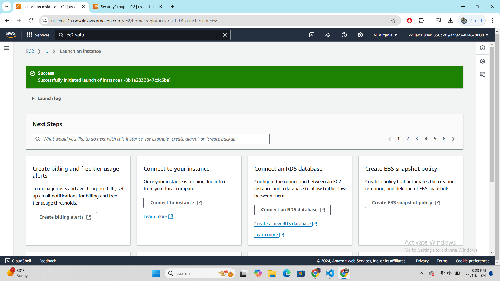
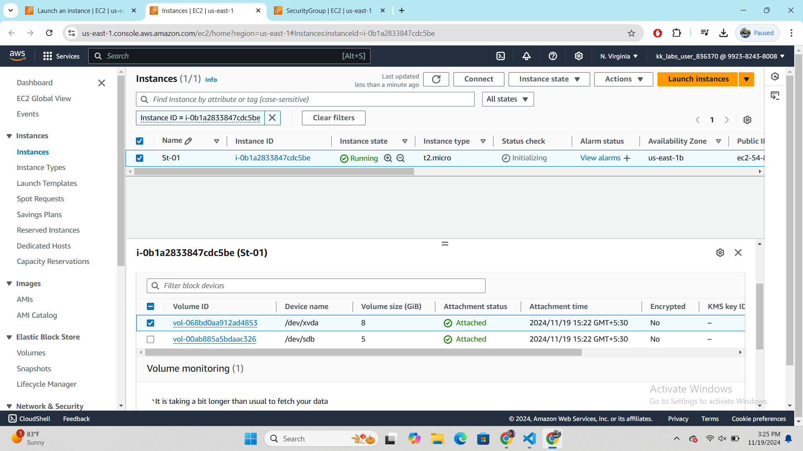
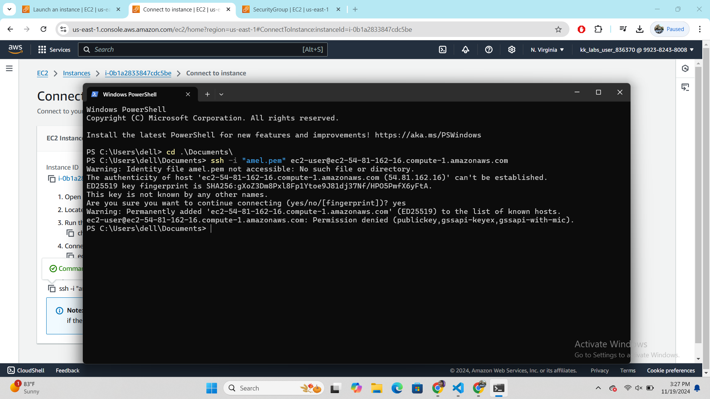

## Creating a real-time application that uses AWS Elastic Block Store (EBS) 
volumes involves integrating the EBS with a running application on an EC2 instance, 
typically managed through Elastic Beanstalk (EBS). 
Here's a guide to set up a simple application that utilizes EBS for storage and can perform real-time tasks.

Project Overview: Real-Time Data Processing Application Using AWS EBS

We'll create a Node.js application that reads and writes data to an EBS volume, allowing real-time interaction. 
The example will involve a simple text-based note-taking application.

Prerequisites
- An AWS account
- AWS CLI installed and configured
- Elastic Beanstalk Command Line Interface (EB CLI) installed
- Basic knowledge of Node.js

Step-by-Step Guide

Step 1: Create and Attach an EBS Volume

1. **Log in to the AWS Management Console** and navigate to the EC2 dashboard.


2. **Create an EBS Volume:**
   - Go to "Volumes" in the left sidebar.
   - Click "Create Volume."
   - Choose a type (e.g., General Purpose SSD), specify size, and select the same availability zone as your EC2 instance.
   - Click "Create Volume."
   

3. **Attach the EBS Volume to an EC2 Instance:**
   - Right-click the newly created volume and select "Attach Volume."
   - Choose the instance from the list and click "Attach."
    
4. **Log into your EC2 instance via SSH.**
   ```bash
   ssh -i your-key.pem ec2-user@your-instance-public-dns
   ```
    
    

5. **Format and mount the EBS volume:**
   - Check available disks:
     ```bash
     lsblk
     ```
   - Format the volume (replace `/dev/xvdf` with your volume device):
     ```bash
     
     sudo mkfs -t ext4 /dev/xvdf
     
     
     ```
   - Create a mount point and mount the volume:
     ```bash
     sudo mkdir /mnt/mydata
     sudo mount /dev/xvdf /mnt/mydata
     ```

6. **Ensure the volume is mounted on reboot:**
   - Add to `/etc/fstab`:
     ```bash
     echo '/dev/xvdf /mnt/mydata ext4 defaults,nofail 0 2' | sudo tee -a /etc/fstab
     ```

Step 2: Set Up Your Node.js Application

1. **Create a new directory for your project:**
   ```bash
   mkdir note-app
   cd note-app
   ```

2. **Initialize a new Node.js project:**
   ```bash
   npm init -y
   ```

3. **Install required packages:**
   ```bash
   npm install express body-parser fs
   ```

4. **Create the server:**
   - Create a file named `server.js`:
     ```javascript
     const express = require('express');
     const bodyParser = require('body-parser');
     const fs = require('fs');
     const path = require('path');

     const app = express();
     const PORT = process.env.PORT || 3000;
     const DATA_FILE = '/mnt/mydata/notes.txt'; // Path to EBS volume

     app.use(bodyParser.json());
     app.use(express.static('public'));

     app.get('/notes', (req, res) => {
         fs.readFile(DATA_FILE, 'utf8', (err, data) => {
             if (err) {
                 return res.status(500).send('Error reading notes');
             }
             res.send(data);
         });
     });

     app.post('/notes', (req, res) => {
         const note = req.body.note;
         fs.appendFile(DATA_FILE, note + '\n', (err) => {
             if (err) {
                 return res.status(500).send('Error saving note');
             }
             res.send('Note saved');
         });
     });

     app.listen(PORT, () => {
         console.log(`Server is running on port ${PORT}`);
     });
     ```

5. **Create a simple HTML client:**
   - Create a directory named `public`, and inside it create an `index.html` file:
     ```html
     <!DOCTYPE html>
     <html>
     <head>
         <title>Real-Time Notes</title>
     </head>
     <body>
         <h1>Notes</h1>
         <div id="notes"></div>
         <textarea id="note" placeholder="Write a note..."></textarea>
         <button id="save">Save Note</button>

         <script>
             const notesDiv = document.getElementById('notes');
             const noteInput = document.getElementById('note');

             function loadNotes() {
                 fetch('/notes')
                     .then(response => response.text())
                     .then(data => {
                         notesDiv.textContent = data;
                     });
             }

             document.getElementById('save').onclick = function() {
                 const note = noteInput.value;
                 fetch('/notes', {
                     method: 'POST',
                     headers: {
                         'Content-Type': 'application/json'
                     },
                     body: JSON.stringify({ note })
                 }).then(() => {
                     noteInput.value = '';
                     loadNotes();
                 });
             };

             loadNotes(); // Load notes on page load
         </script>
     </body>
     </html>
     ```

Step 3: Create the Elastic Beanstalk Application

1. **Initialize Elastic Beanstalk:**
   ```bash
   eb init -p node.js-14 note-app
   ```
   Replace `node.js-14` with the version you want to use.

2. **Create an environment and deploy:**
   ```bash
   eb create note-app-env
   ```

3. **Deploy your application:**
   ```bash
   eb deploy
   ```

Step 4: Access Your Application

1. After deployment, the EB CLI will give you a URL to access your application.

2. Open a web browser and navigate to the provided URL. You should see your note-taking application.

Step 5: (Optional) Configure Monitoring and Scaling

You can adjust your environment settings to enable load balancing, scaling, and monitoring through the Elastic Beanstalk console.

Step 6: Cleanup

To avoid charges, terminate your environment after completing your project:

```bash
eb terminate note-app-env
```


You’ve created a simple real-time note-taking application using AWS EBS for storage,
allowing you to write and read notes persistently.
This setup illustrates how to integrate EBS with an application hosted on AWS Elastic Beanstalk.