AWS - JAVA - RDS - Setup

- Cx wants the app to be run in Pub-Sub

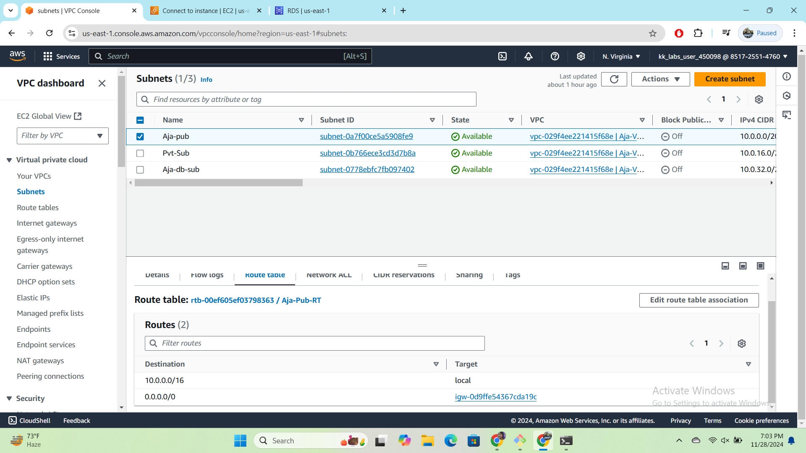

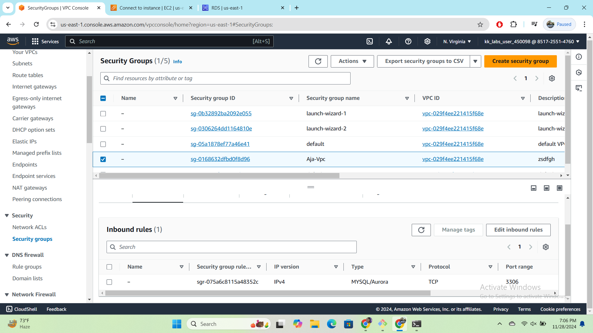

- Cx wants the DB to run in Pvt-Sub

#1st create a Pub-Ec2 in Pub sub
#Create a Pvt-Ec2 in Pvt Sub
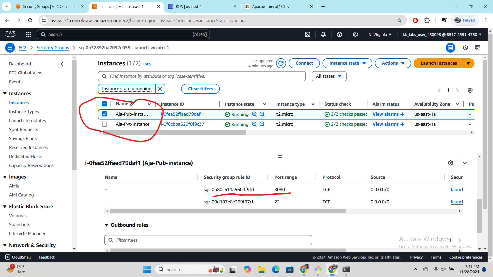
#Create a Database for the application config

Step 1
- Go to RDS
- Create Database
- DB - Mysql - Version-5.74
- Type - Free tier
- Storage - 20gb
- DB - Name - Test
- Username - admin
- password - admin123
- VPC - Select VPC
- Create DB
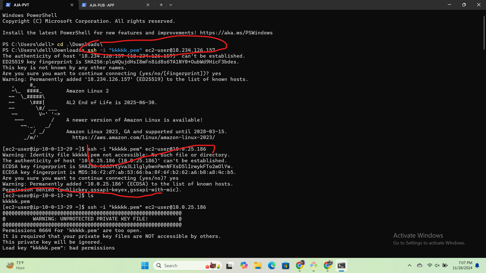
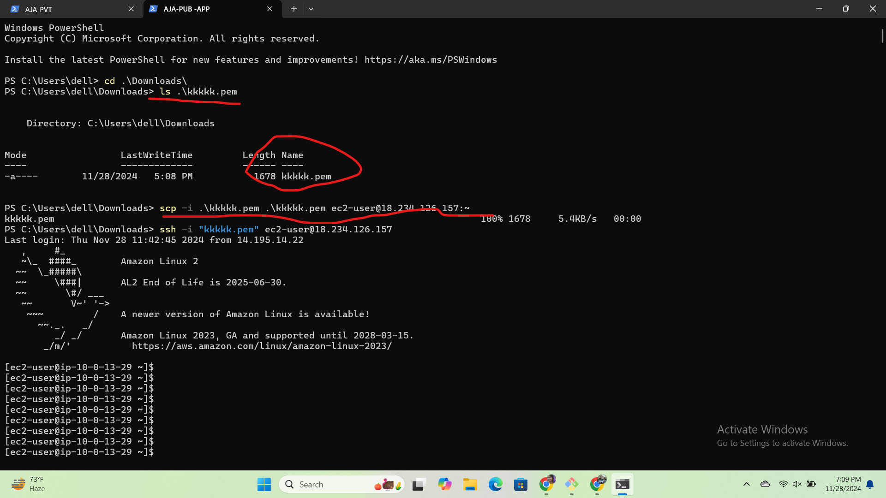
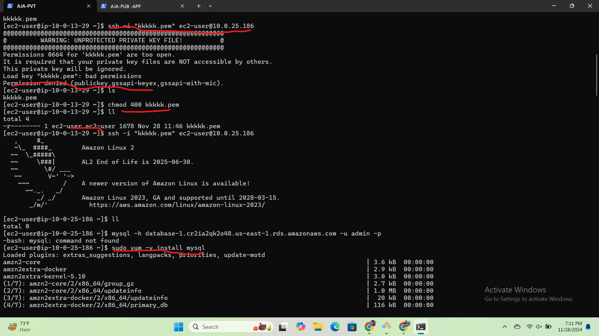

#Once the DB is created, this needs to be connected to PVT-EC2

- SSH to Pvt-Ec2
- Install mysql 
- sudo yum -y install mysql

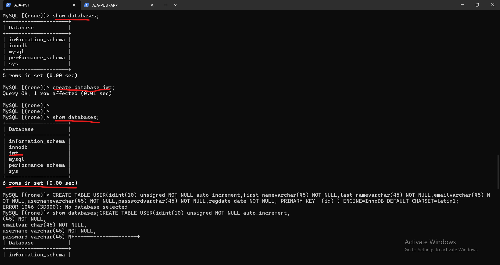

#Connect to DB
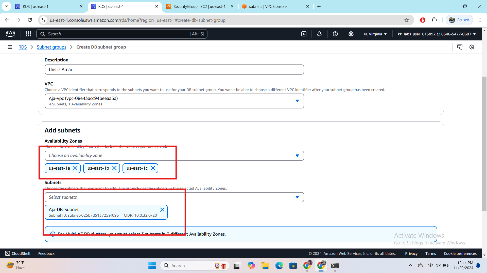
- mysql -h <data-base-end-point> -u username -p password

#This will connect us to the DB
#Create a CUstom Db and Tables for the Application

- create database jwt;
- select jwt;
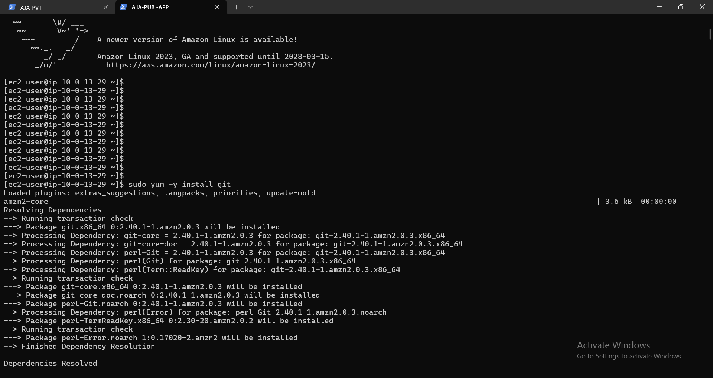

#Create a table by the USER, with the below schema

CREATE TABLE USER(id int(10) unsigned NOT NULL auto_increment,
first_name varchar(45) NOT NULL,
last_name varchar(45) NOT NULL,
email varchar(45) NOT NULL,
username varchar(45) NOT NULL,
password varchar(45) NOT NULL,
regdate date NOT NULL, 
PRIMARY KEY  (id) ) ENGINE=InnoDB DEFAULT CHARSET=latin1;

#Once the DB is ready, This DB should be integrated with the code

- CODE Deployment

#To deploy the code follow the below steps

- Create a Pub-Ec2 with SSH and 8080 ports
- Connect to Ec2

#Install git , Java , maven and tomcat

- sudo yum -y install git

#Clone the code from github
- git clone https://github.com/Ai-TechNov/aws-rds-java.git

#Once code is cloned, we need update config

- cd aws-rds-java

#Edit login.jsp and userreg.jsp files

vim src/main/webapp/login.jsp
vim src/main/webapp/userRegistration.jsp

#In these files, update connection con with DB details and credentails

Connection con = DriverManager.getConnection("jdbc:mysql://<update-database-end-point.:3306/jwt","<DB-user-name>", "DB-password")

#Once these details are updated, lets build the code
#Install java and maven to build

- sudo yum -y install java-1.8*
- sudo yum -y install maven

#Lets package the code

- cd aws-rds-java
- mvn package

#This command will build and package the code into artifact
#This will create a target folder with a .war file.

#This artifact .war file needs to be deployed on a web-server env

#We will use tomcat to deplpoy the artifact. 

#Download tomcat
- browse https://tomcat.apache.org/download-90.cgi
- wget https://dlcdn.apache.org/tomcat/tomcat-9/v9.0.97/bin/apache-tomcat-9.0.97.tar.gz
- tar -xvf apache-tomcat-9.0.97.tar.gz
- cd apache-tomcat-9.0.97

#here we need to start and config tomcat
#To start

- cd apache-tomcat-9.0.97
- cd bin
- ./startup.sh
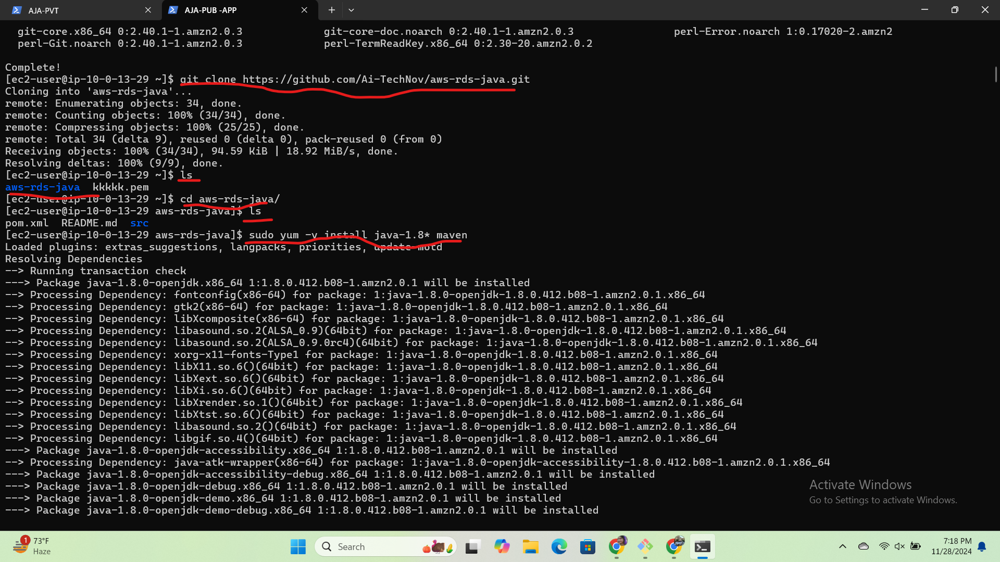
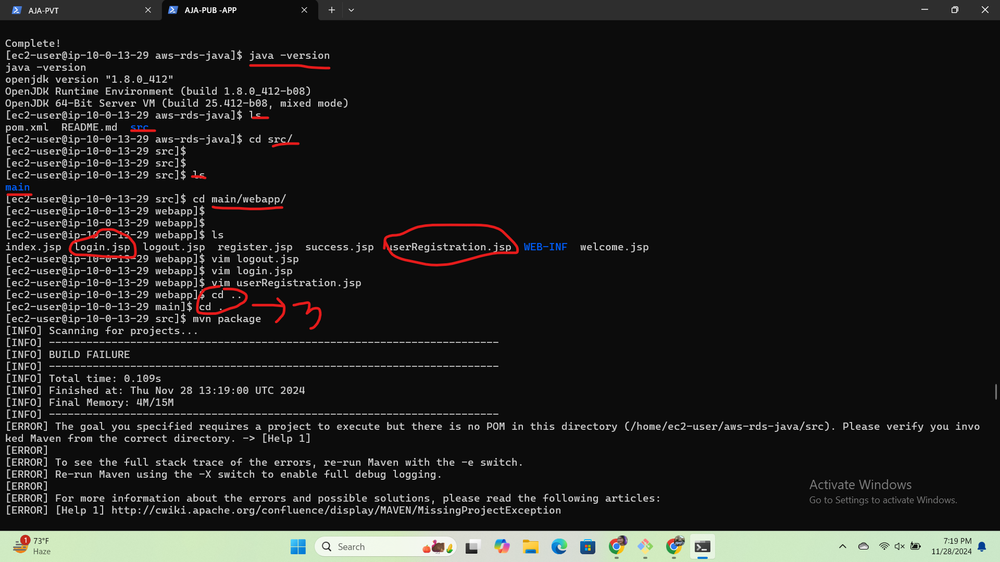
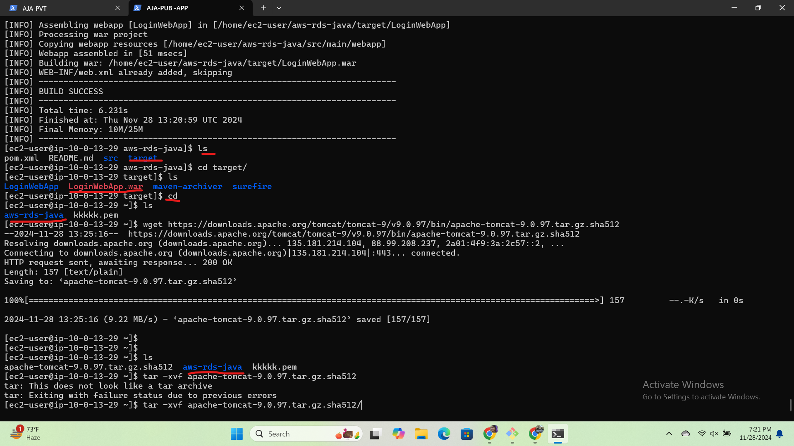

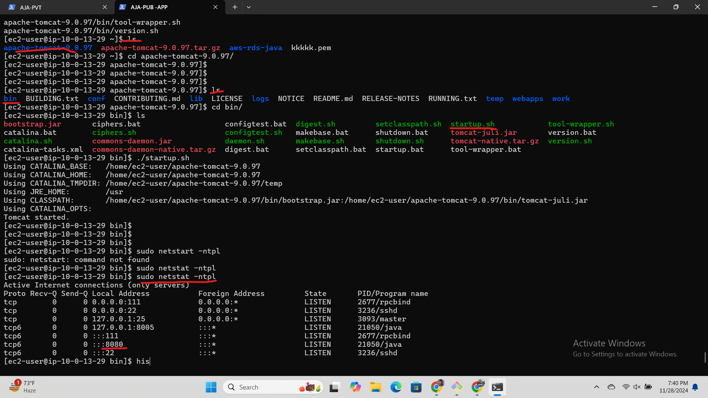
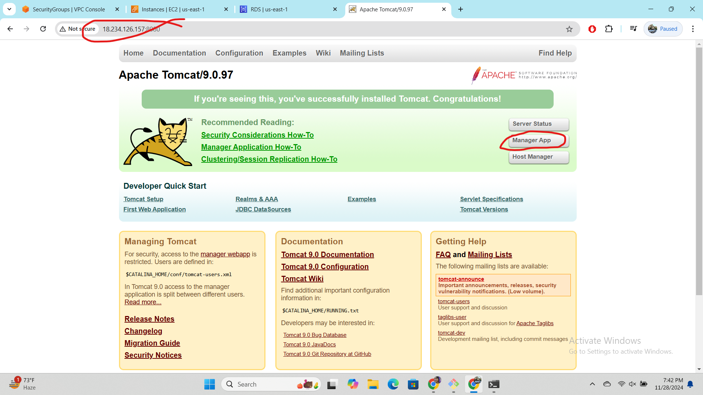

#This will start TC and TC will be running on port 8080.

#Now, need to updated tomcat context.xml file

- find -name context.xml
- vi ./webapps/host-manager/context.xml
- vi ./webapps/manager/context.xml

#In this file, you need to comment the lines 21 and 22 !!

#Then we need to update login credentails in tomcat users file.

- go to conf 
- cd conf
- vim tomcat-users.xml

#At the bottom
#update user credentials

<role-name>=
<user-name>=
</tomcat-user>

#Once the user info is comfigured, we can connect and login into TC web app manager.
#To finally access the app
#Copy the artifact to tomcat webapps

- cp -r /aws-rds-java/target/*.war /apache-tomcat-9.0.97/webapps/

#Once the artifact is copied. we can access the application.
#The data received through the app will be stored in the DB in the backened !!!